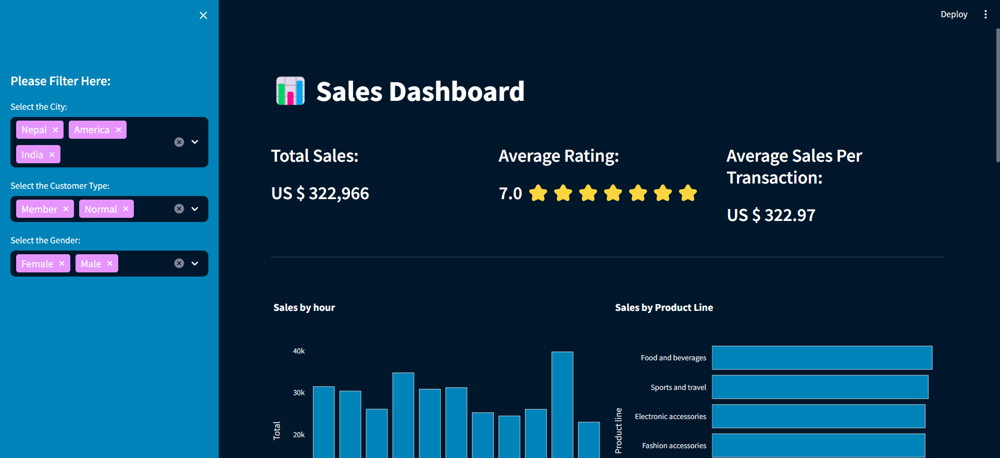

# Sales Dashboard - Data Analytics Final Project

Welcome to the Sales Dashboard project, my final project for the Data Analytics course. In this project, I have created an interactive dashboard to visualize and analyze sales data. This dashboard provides valuable insights into our sales performance, helping us make data-driven decisions and understand trends over time.

## Features

- **Interactive Visualizations:** Explore sales data through interactive charts and graphs.
- **Data Analysis:** Gain insights into sales trends, top-performing products, and customer behavior.
- **User-Friendly Interface:** Easy-to-use interface for seamless navigation and understanding of the data.
- **Customization:** Customize the dashboard to view specific time periods, products, or regions.

## Technologies Used

- **Programming Language:** Python
- **Data Visualization:** Matplotlib, Seaborn, Plotly
- **Dashboard Framework:** Dash by Plotly
- **Data Processing:** Pandas, NumPy

## How to Use

1. Clone this repository to your local machine.

2. Install the required libraries if you haven't already.

3. Run the dashboard application.

4. Open your web browser and go to `http://localhost:8050` to view the dashboard.

## Screenshots

## Contributing

Contributions are welcome! If you find any issues or have suggestions for improvement, please open an issue or create a pull request.

Feel free to explore the dashboard and gain insights into our sales data! If you have any questions or feedback, don't hesitate to reach out.

Happy analyzing!

[Raj Kumar Jaiswal] 
